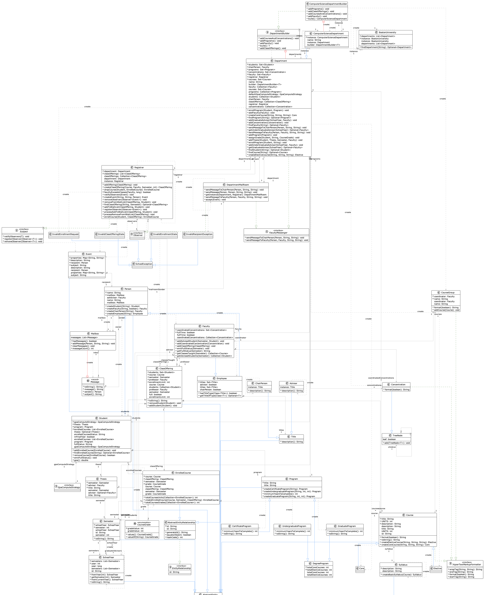
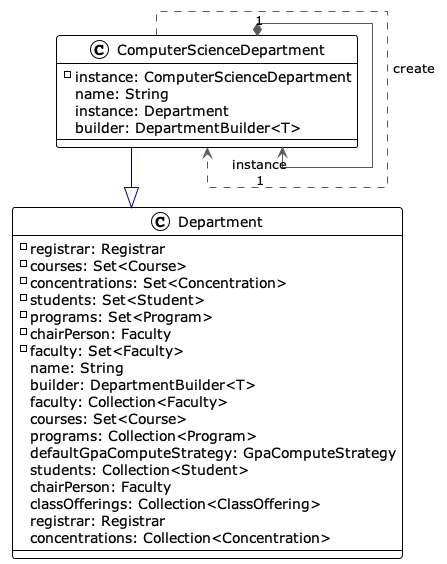
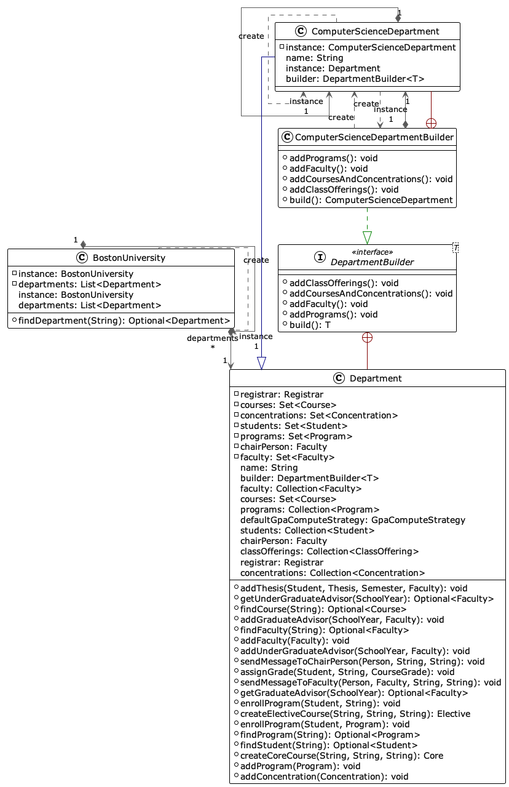
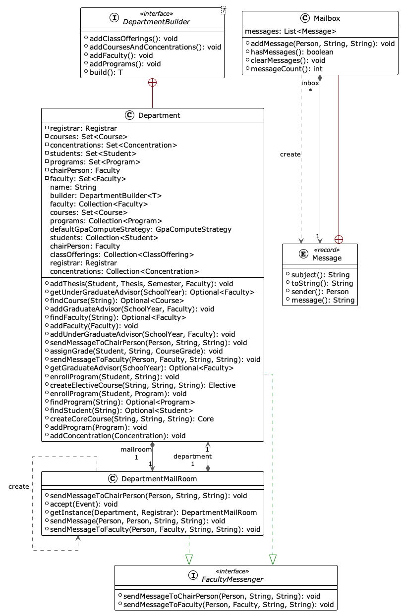
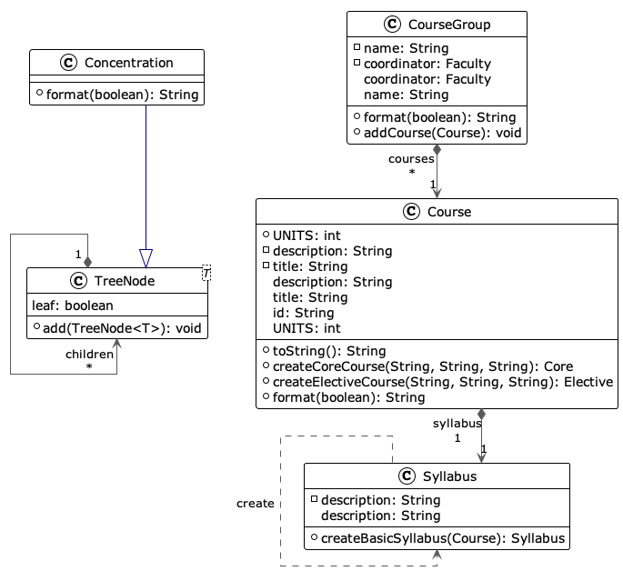
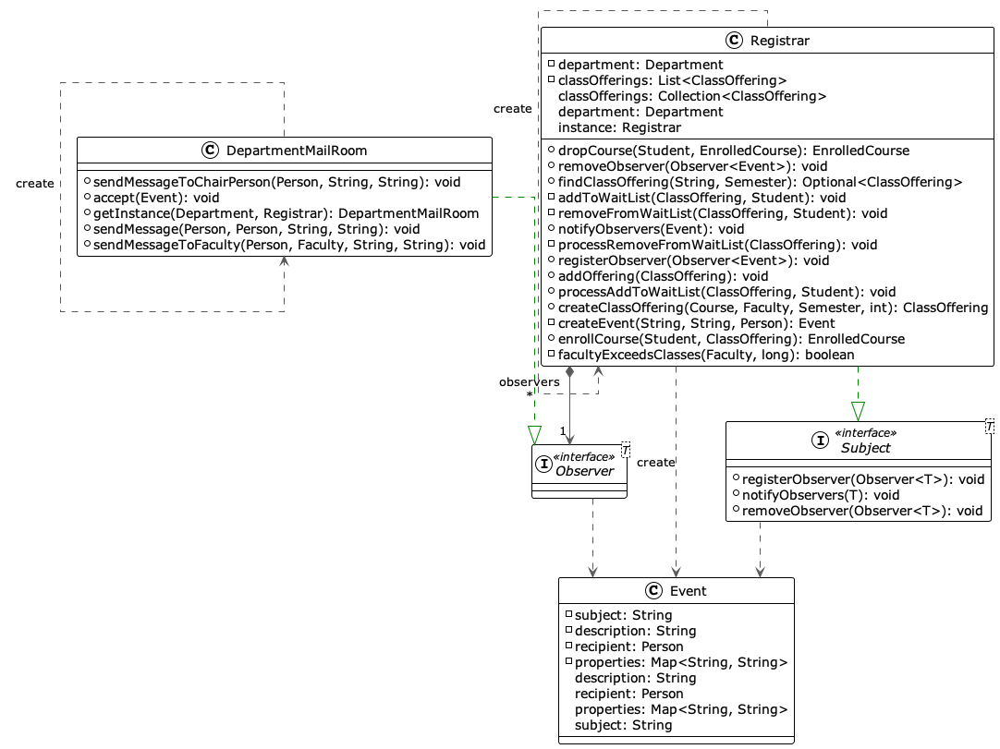
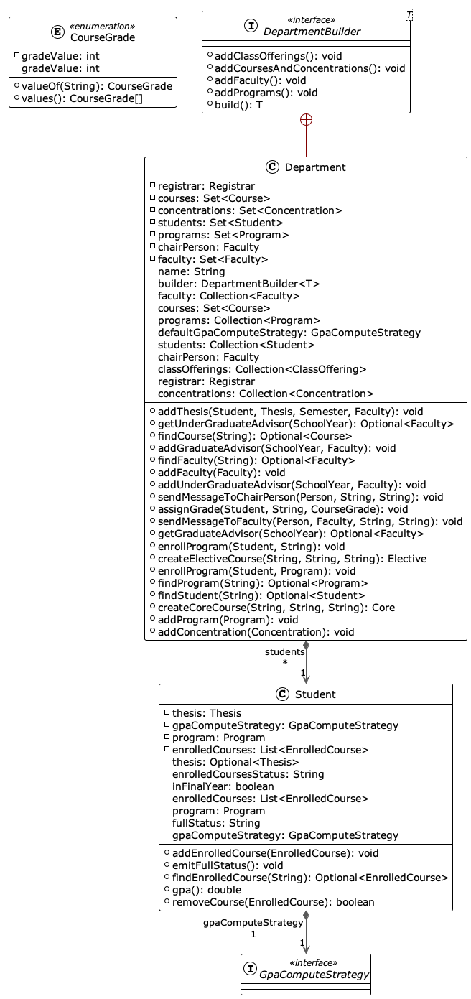

# CS665 Term Project

## Overview

This is an application that simulates a department (swith focus on the Computer Science Department) of a university.  There is a class hierarchy for the students and employees along with their responsibilities as well as the artifacts that each person interacts with.  

The purpose of the project is to demonstrate the software design patterns in the class.

Outside of using [JUnit](https://junit.org/junit5/) to show output and [Spotless](https://github.com/diffplug/spotless) for automatic formatting of code, the application was deliberately implemented to be self-contained and not to use any other third-party library dependencies to highlight that every design pattern is implemented from the ground up.

## Build and Output

The application uses Gradle, to build it:

```shell
$ gradle build 
```

### Output

The output of the application runs under a JUnit test, so you can simply run using Gradle:

```shell
$ gradle test 
```

### Sample Output

This is the sample output that simulates enrolling and dropping classes as well as the waitlist use case:

```
INFO: 0 containers and 3 tests were Method or class mismatch
INFO: Adding program Certificate Program Web Application Development
INFO: Adding program Undergraduate Program Computer Science
INFO: Adding program Graduate Program Software Development
INFO: Setting Tony Stark as Chairperson
INFO: Setting Peter Parker as Graduate advisor for 2022
INFO: Setting Steve Rogers as Undergraduate advisor for 2022
INFO: Adding Thor Odinson as full-time faculty
INFO: Adding Suresh Kalathur as full-time faculty
INFO: Adding Wanda Maximoff as full-time faculty
INFO: Adding Pietro Maximoff as part-time faculty
INFO: Adding Simon Williams as part-time faculty
INFO: Adding Henry Pym as part-time faculty
INFO: Added course offering: Class offering for [Data Structures and Algorithms] Semester [1] Professor [Thor Odinson] Limit [2]
INFO: Added course offering: Class offering for [Software Design and Patterns] Semester [1] Professor [Suresh Kalathur] Limit [2]
INFO: Added course offering: Class offering for [Mobile Application Development with Android] Semester [2] Professor [Thor Odinson] Limit [2]
INFO: Added course offering: Class offering for [Database Design] Semester [2] Professor [Suresh Kalathur] Limit [2]
INFO: Mailbox [Tony Stark] receives message: Message from [Mailroom] Subject [Course Offering Full] Message [Course offering Class offering for [Software Design and Patterns] Semester [1] Professor [Suresh Kalathur] Limit [2] is full]
INFO: Mailbox [Will Turner] receives message: Message from [Mailroom] Subject [Waitlist notification] Message [You are waitlisted for Class Class offering for [Software Design and Patterns] Semester [1] Professor [Suresh Kalathur] Limit [2]]
INFO: Mailbox [Tony Stark] receives message: Message from [Mailroom] Subject [Course Offering Full] Message [Course offering Class offering for [Software Design and Patterns] Semester [1] Professor [Suresh Kalathur] Limit [2] is full]
INFO: Auto-enroll Will Turner to Class offering for [Software Design and Patterns] Semester [1] Professor [Suresh Kalathur] Limit [2] successful
```


## Class Diagram



[PlantUML](docs/diagrams/full-class-diagram.puml)

## Creational Design Patterns

### Singleton 

The pattern is used in various sections of the code but here is an example that creates the  `ComputerScienceDepartment` instance which is the subclass of the `Department` abstract class.



[PlantUML](docs/diagrams/singleton.puml)

### Builder 

The pattern is utilized to create instance of the resulting `Department` instance(s).  The main idea is that `BostonUniversity` is the class that generates the department using their corresponding builders.  So in essensce, the `BostonUniversity` class also acts as the build director.



[PlantUML](docs/diagrams/builder.puml)

## Structural Design Patterns

### Bridge 

A variation of this pattern abstracts how the students and observers sends notification.  In this particular implementation, the `Department` act as a bridge so the `FacultyMessenger` implementation is abstracted from the rest of the application and can be swapped out with a different implementation without disturbing the rest of the code.



[PlantUML](docs/diagrams/bridge.puml)

### Composite 

This is utilized on the way concentrations/subconcentrations/course are managed to implement the `format()` method to generate an HTML that lists all concentrations, sub-concentrations, course and the corresponding syllabus.  This leveraging the use of Java generics.



[PlantUML](docs/diagrams/composite.puml)

## Behavioral Design Patterns

### Observer 

The observer is used here in a way that instead of having the class as the Subject, we instead have the entire Registrar as the Subject.  We also don't have the individual students and faculty as observers; instead we have the DepartmentMailRoom as the observer.  With this approach we have message query _and_ notification use the same classes.  This is also more efficient as there is only one subject/observer.



[PlantUML](docs/diagrams/observer.puml)

### Strategy

The pattern is used for computing GPA, allowing more than one approach for computing GPA whether curved or not, although only one strategy is implemented here (non-curved).



[PlantUML](docs/diagrams/strategy.puml)

## Implementation Notes

### Assumptions

- A member of the faculty cannot be a student.  In other words, a student named "John Doe" is treated as separate entity as faculty member "John Doe" even though realistically they can be referring to the same person.
- A student takes courses in consecutive school years (no gap).

### Notes

- Objects/classes are subclassed from `AbstractEntity` or `AbstractEntityRelationship` which implements a `getId()` method.  Since there is a lot of lookup in collections, this basic abstract classes overrides `Object::equals` to ensure value equality through their `getId()`.
- Application relies on `java.util.logging` package to emit messages on the console.